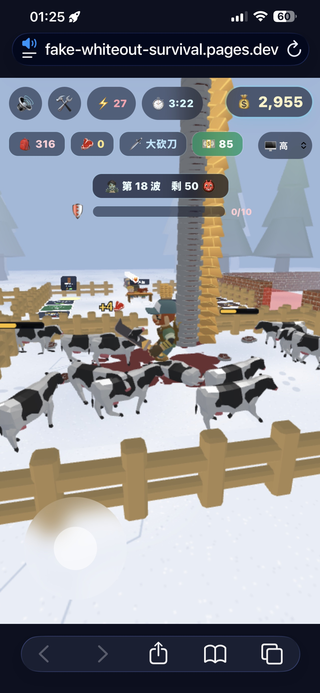

# 🥩❄️ 偽寒冰啟示錄 Fake Whiteout Survival

> 一款雪地主題的 **放置經營 × 塔防** 網頁小遊戲：經營肉舖 → 擴張牧場 → 自動化生產 → 蓋房子 → 蓋塔守城,撐過 **30 波殭屍** 即破關!
> 靈感來自買量廣告常見的「雪地賣肉舖」。

🎮 **線上遊玩(全球共享排行榜):** https://fake-whiteout-survival.pages.dev

技術棧:**Vue 3 + Vite 6 + TypeScript + Tailwind 4 + Babylon.js 9**,後端 **Cloudflare Pages Functions + D1**。

## 📸 遊戲畫面

| 首頁 | 牧場獵牛 | 近戰殭屍 | 塔防守城 |
|:---:|:---:|:---:|:---:|
|  |  |  |  |

---

## ✨ 特色

- **🐄 放置經營循環** — 獵牛取肉 → 擺攤陳列 → 顧客購買 → 收銀進帳,錢拿去升級擴張。
- **💣 牧場擴張** — 買炸藥($500)炸開旁邊樹林,解鎖 **牧場 2**,出現血量/肉量加倍的強化怪。
- **🤖 自動化員工** — 雇用 **獵人**(自動打牛)、**收銀員**(自動收錢丟回你背上)、買 **牧羊犬**(自動撿肉,一次扛 100 片)。
- **🗡️ 三種武器** — 大砍刀(快速橫掃)、迴旋斧(攻擊時旋轉打周圍全部敵人)、衝鋒槍(遠距掃射,含槍口火光與彈道)。
- **🏰 塔防守城** — 蓋好房子($1000)後殭屍開始來襲。在四個角落蓋 **箭塔 / 砲塔**,點擊塔可看 **射程環** 並開 **升級選單**(射程↑、傷害↑、等級標示與升級特效);每 3 波出 **Boss**,**撐過第 30 波即破關**。
- **🏆 全球社群** — 排行榜、留言板(含版主刪除)、線上人數、全服累計統計(總賺錢/殺牛數/殺怪數/場次)。
- **🏅 成就系統** — 11 項成就,首頁可檢視解鎖進度。
- **🎵 5 軌背景音樂** + 打擊/擊殺音效與粒子特效、漂浮數字。
- **⚡ 效能** — 樹林採 Babylon **thin-instance**(數千棵樹 CPU 成本幾乎不變)。

## 🕹️ 玩法循環

1. **獵牛** — 走進牧場靠近牛,自動以裝備武器攻擊;牛死亡爆出數塊肉。
2. **撿肉** — 走過掉落的肉自動撿起,背在身上越疊越高。
3. **擺攤** — 走回攤位把背上的肉擺上陳列架。
4. **販售** — 顧客排隊進場買肉付錢。
5. **收銀** — 走過收銀格把錢收進錢包(金條飛回背上)。
6. **升級擴張** — 用錢買武器、炸藥開牧場 2、雇員工、招攬客流、蓋房子。
7. **守城** — 房子蓋好後殭屍來襲,蓋塔/升級塔,撐過 30 波破關。

## 🎮 操作

- **移動**:左下角虛擬搖桿,或鍵盤 `WASD` / 方向鍵。
- **互動全自動**:走到攤位/收銀/購買框旁站著不動即自動進行。
- **塔**:點擊塔顯示射程與升級選單。
- **武器/購買框**:踩上去站著付款,買滿即解鎖;已購買的踩上去切換。

## 🛠️ 技術棧

| 層 | 技術 |
|---|---|
| 前端框架 | Vue 3 `<script setup>` + Vite 6 + TypeScript(strict) |
| 樣式 | Tailwind CSS 4 |
| 3D 引擎 | Babylon.js 9(InstancedMesh / thin-instance / AnimationGroup / 粒子系統),GLB + Draco |
| 後端 | Cloudflare Pages Functions(`/api/*`)+ D1(SQLite) |
| 部署 | Cloudflare Pages |

## 🚀 本機開發

```bash
npm install
npm run dev      # 開發伺服器 http://localhost:5173（無 /api，社群功能自動回退 localStorage）
npm run build    # 型別檢查（vue-tsc）+ production build
npm run preview  # 預覽 build 結果
```

> 純前端即可完整遊玩;社群功能(排行榜/留言/線上人數)在無後端時自動使用 localStorage,有部署 Cloudflare 時自動切換成全球共享。

## ☁️ 部署 / 後端

全球排行榜、留言板、線上人數、累計統計由 Cloudflare Pages Functions + D1 提供。
部署步驟、API 列表與**安全性加固**(速率限制 / 髒話過濾 / 排行榜合理性 / 版主刪除留言)詳見 **[BACKEND.md](BACKEND.md)**。

更新線上版:

```bash
npm run build
npx wrangler pages deploy dist --project-name=fake-whiteout-survival --branch=main --commit-dirty=true
```

## 📁 專案結構

```
src/
  components/      Vue 元件（game-view 主畫面、hud、landing-screen 首頁、虛擬搖桿）
  game/            遊戲核心
    game.ts          createGame：所有玩法（牧場/武器/員工/塔防/社群統計）
    config.ts        所有可調參數（價格、波數、塔屬性…）
    model-loader.ts  GLB 載入、正規化、動畫比對
    tree-field.ts    thin-instance 樹林
    floating-text.ts 漂浮數字
    achievements.ts  成就定義與本機存檔
    community.ts     社群資料（離線優先：先打 /api，失敗回退 localStorage）
    sound.ts         BGM + 音效
functions/api/     Cloudflare Pages Functions（run / leaderboard / totals / messages / heartbeat / online）
public/models/     GLB/glTF 3D 模型資產
schema.sql         D1 資料表結構
wrangler.jsonc     Cloudflare Pages / D1 設定
```

## 🙏 資產來源

3D 模型為 glTF/GLB 格式低多邊形素材(角色、怪物、建築、道具、塔等),置於 `public/models/`。
程序化雪原地面、模型載入正規化、等距相機等基礎沿用姊妹專案 `winter`。

## 📄 授權

僅供學習與展示用途。3D 模型素材版權歸原作者所有。
